# Limn
A high quality, performant, realtime, concurrency-first, physically based renderer written in zig with Vulkan 1.3

Latest docs are published to https://tofaa2.github.io/limn/
Changes can also be found in CHANGELOG.md

# Path tracing
Path tracing is WIP and contains noise, unfortunately RTX is an oversold concept for marketing that requires vendor locked software and tooling to make it look actually good. Its recommended to keep regular ray tracing enabled and path tracing disabled.

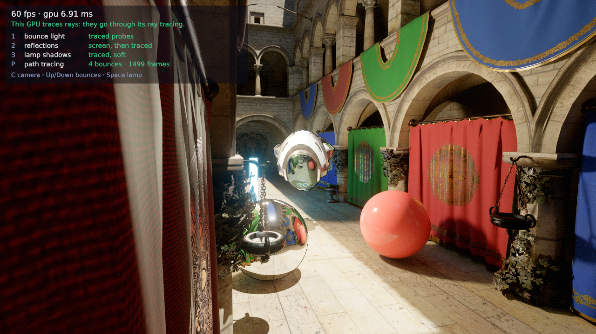

| 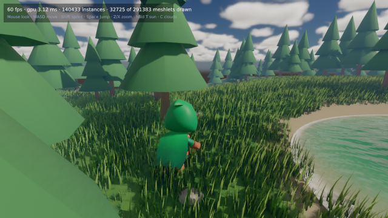 | 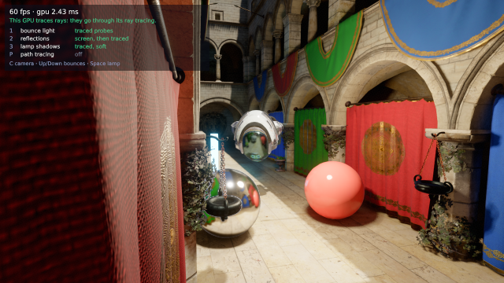 | 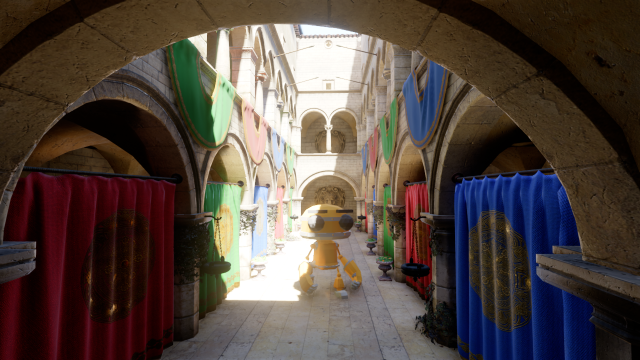 |
|:-:|:-:|:-:|
| **meadow** | **rtx** | **world** |
| 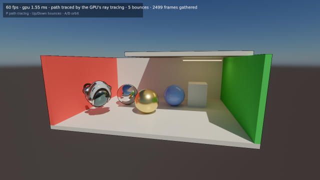 | 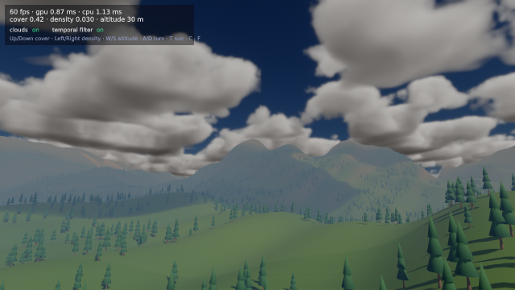 | 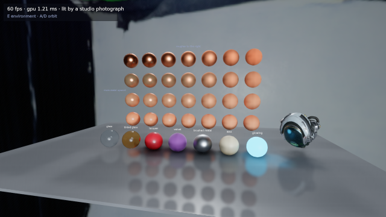 |
| **pathtrace** | **clouds** | **materials** |
| 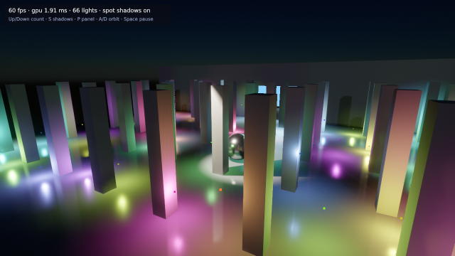 | 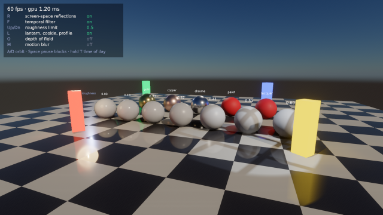 | 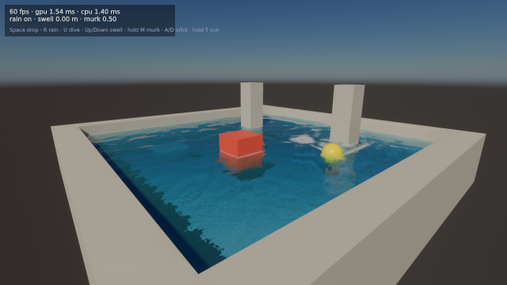 |
| **lights** | **reflections** | **water** |
| 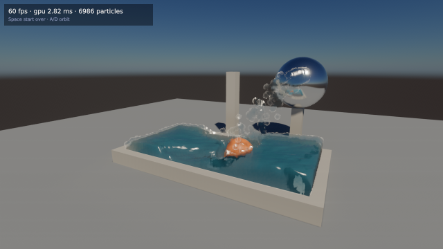 | 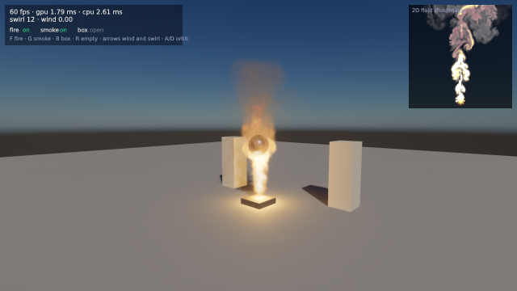 | 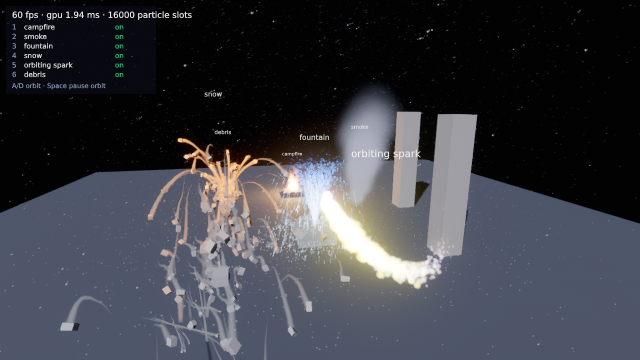 |
| **liquid** | **fluid** | **particles** |
| 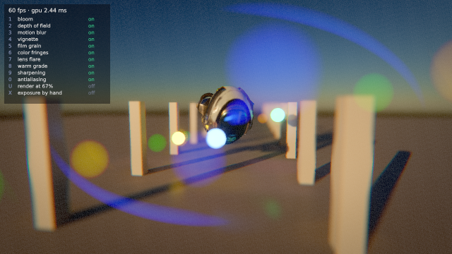 | 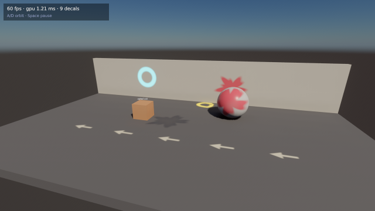 | 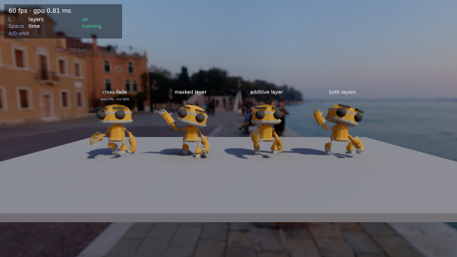 |
| **post** | **decals** | **animation** |
| 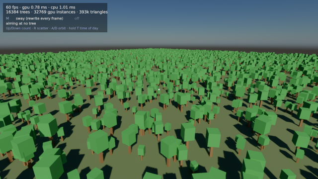 | 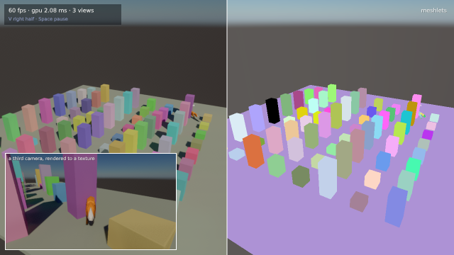 | 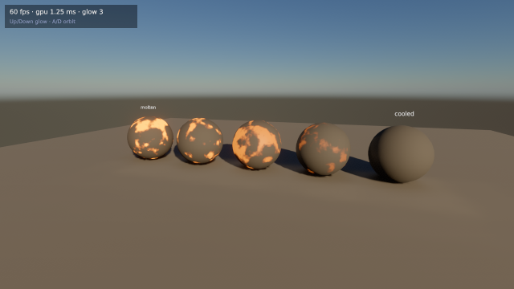 |
| **instancing** | **views** | **shader** |
| 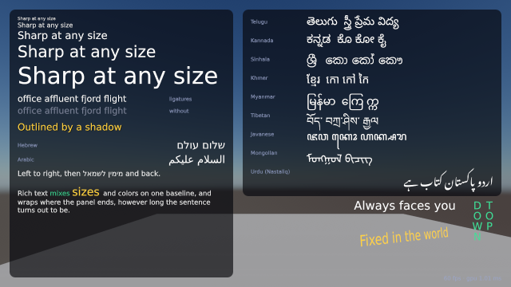 | 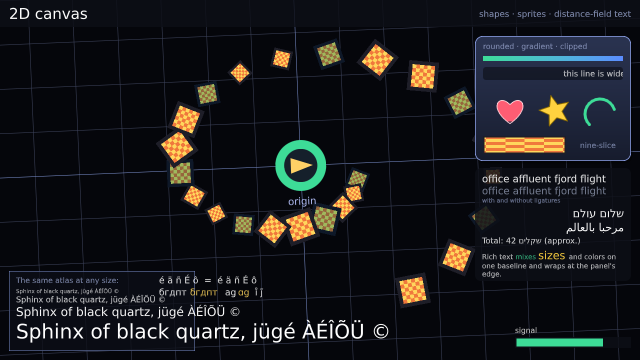 | 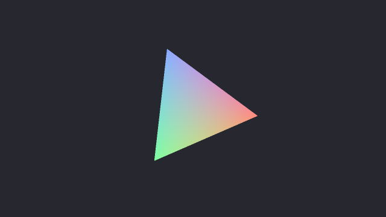 |
| **text** | **canvas** | **triangle** |
| 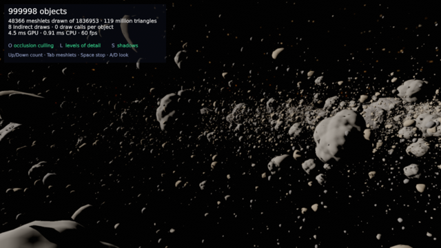 | 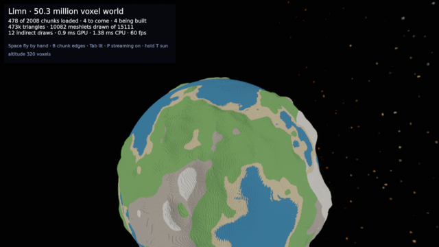 | 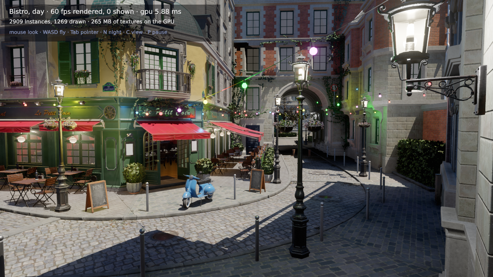 |
| **asteroids** | **voxels** | **bistro** |

Every picture is an example in `examples/`: run it with `zig build <name>`.

```zig
const gfx = @import("limn");

const renderer = try gfx.Renderer.init(gpa, io, .{ .surface = surface });
defer renderer.deinit();

const scene = try renderer.scenes.create();
const model = try renderer.models.load("helmet.glb");
_ = try renderer.entities.spawn(scene, .{ .model = model });
renderer.scenes.setSun(scene, .{ .direction = .{ -0.4, -1.0, -0.3 } });

while (running) {
    _ = try renderer.render(.{
        .views = &.{.{ .scene = scene, .camera = gfx.Camera.lookAt(eye, target) }},
        .delta_time = dt,
    });
}
```

## Build

Requires Zig 0.16, a Vulkan 1.3 driver and `glslc`. The Vulkan headers and
loader are fetched by the build; the examples also need GLFW, which is
fetched on Windows and linked from the system elsewhere. `flake.nix`
provides everything. The example assets are stored with Git LFS: run
`git lfs install` before cloning, or `git lfs pull` afterwards.

```sh
zig build            # library and examples
zig build run        # the meadow example
zig build test       # unit tests
zig build checks     # picking, reloading, streaming and out of memory, without a window
zig build verify     # formatting, tests, and the examples under Vulkan validation
zig build docs       # API reference in zig-out/docs
```

Add `-Doptimize=ReleaseFast` for full speed. Every example takes `--frames N`
and `--screenshot file.png`, and lists its keys at the top of its source
file.

## Documentation

`zig build docs` writes the API reference from the doc comments in `src`.
After that you can use python to serve you the documentation as a webserver with `python3 -m http.server 8000 -d zig-out/docs`

## Platforms

Developed and tested on Linux with an NVIDIA GPU and with Mesa's software
driver. It cross-compiles for Windows, but has not yet been verified on
Windows itself, nor on AMD or Intel GPUs.

## LLM Notice
AI was used for documentation, README prettification, examples, and specific core content. All code PR'ed to this, repo if LLM developed, requires complete verification by the developer. Slop PR's will not be accepted all LLM code must be reviewed.

## License

Apache-2.0; see [`LICENSE`](LICENSE). Bundled work keeps its own terms:

- meshoptimizer (MIT): `src/third_party/meshoptimizer`
- Basis Universal transcoder (Apache-2.0): `src/third_party/basisu`
- FidelityFX Denoiser, reflection part (MIT): `src/third_party/ffx_denoiser`
- FidelityFX Super Resolution 1 (MIT): `src/third_party/ffx_fsr1`
- FidelityFX SDK 1.1.4, for Super Resolution 2 and 3 (MIT): `src/third_party/ffx_sdk`
- DejaVu Sans, the built-in font: `src/render/fonts/LICENSE`
- Example models, environments and fonts, some for non-commercial use only: `examples/assets/README.md`
